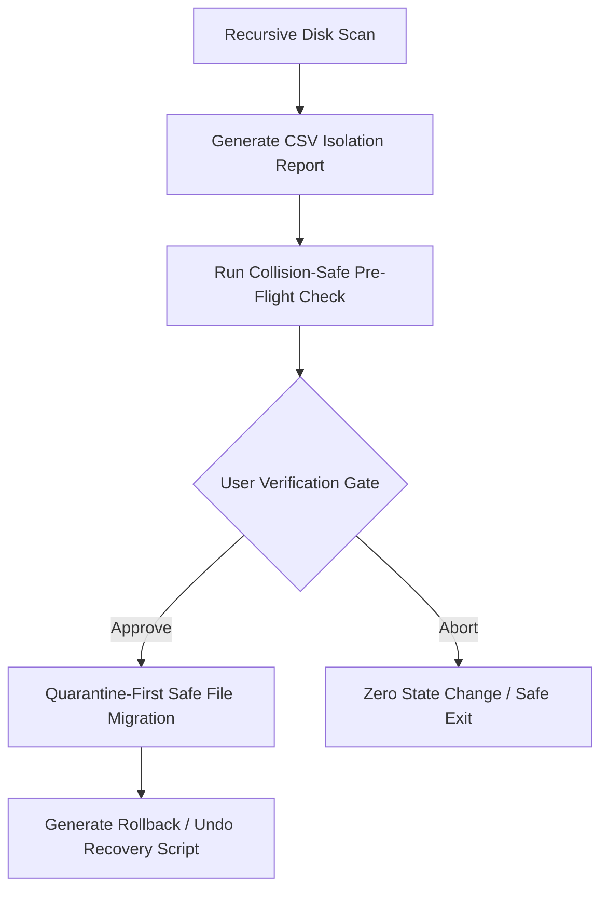

# Safe File Organizer (Enterprise-Grade Filesystem Utility)

A mission-critical Python Command-Line Interface (CLI) utility built explicitly for scanning, auditing, classifying, and sanitizing volatile, high-volume filesystem environments (such as synced cloud directories or corporate network shares) where **data loss is absolutely unacceptable**.

## 🛡️ Safety-First Execution Framework

Unlike primitive cleanup scripts that blindly perform destructive filesystem operations, this utility implements a strict multi-tiered safety validation protocol modeled after industrial control system verification:

## 🛠️ Production-Grade Implementation Details

* **Scale-Tested Processing:** Fully optimized to execute deep recursive scans across large directories containing **40,000+ files** without thread-locking or memory degradation.
* **Deterministic Collision Prevention:** Employs SHA-256 validation routines to accurately classify cleanup candidates and enforce unique namespace allocations, completely mitigating directory overwrite vulnerabilities.
* **Total Traceability:** Generates exhaustive, reviewable audit CSV artifacts tracking explicit state shifts alongside automated python recovery scripts for 100% reversible rollbacks.
